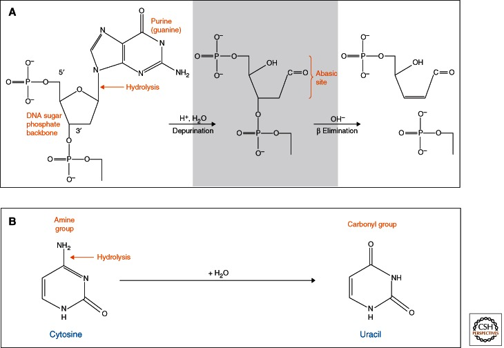

> 原档：C023
>
> 教师：宁超
>
> 吉林大学分子生物学，德国马普所考古遗传系
>
> cning@pku.edu.cn

考古遗传学，俗称古DNA
$$
马普所人类历史研究所\begin{cases}
考古学系 \\\\
语言学系 \\\\
考古遗传系（古DNA）
\end{cases}
$$

### 1.DNA

是生物体一切生命信息的载体，存储几乎所有遗传信息

研究古人群基因交流比例：定量、准确判断人类迁徙情况（辅助语言学研究）

### 2.细胞内DNA

$$
\begin{cases}
细胞核DNA\begin{cases}
常染色体\begin{cases}
30亿碱基 \\\\
每代都重组，获取更复杂的祖先信息（从哪里来）
\end{cases} \\\\
性染色体：其中Y染色体\begin{cases}
60万碱基 \\\\
父系遗传，包含非重组区
\end{cases}
\end{cases} \\\\
线粒体DNA：很小型的环状DNA\begin{cases}
细胞中数量多 \\\\
母系遗传，不经历重组
\end{cases}
\end{cases}
$$

平均每13800年突变一次，已突变1：7万

每一代大致间隔25年

### 3.基因差异

30亿碱基

人类个体SNPs数量3-4百万（SNP：多态性，特定核苷酸位置上有突变，每种位基因在群体中的频率都很小）

**人的多样性少。←人活动性强，基因交流强**

基因差异：同卵双胞胎0；不同人类1/1000；人和黑猩猩1/100

### 4.古DNA研究材料

考古材料、陈旧性样品（法医）

部位：人骨、★牙齿、毛发、颞（niè）骨、听小骨、粪化石

#### 特典

1. DNA含量（丰度）低 DNA本身保存时间很长（寒冷状态有利于保存，Nature：130万猛犸象基因组，来自西伯利亚永久性冻土层） 包含微生物成分（人的DNA只占提取的1%）
2. DNA末端存在广泛损伤 
A:碎片化（fragmentation，脱嘧啶），B:胞嘧啶脱氨（deamination）
 B:C脱氨为U，扩增时U配对A，导致**末端C被识别为T** 计算机可只挑有损伤的片段，区分现代人DNA污染（扩增先扩长片段，很多早期研究失败，都是因为扩的现代人DNA污染）
3. 随时间逐渐累积（大致规律，匹配性不好）
4. 片段高度降解，碎片化：仅60bp长度

### 5.古DNA学科发展

萌芽期：

扩增技术：【分子克隆】：插入细菌、培、敲、纯化（半个月到一个月）

1980 湖南医学院提取马王堆女性核酸，没有测序，未得公认

1984Higuchi提取斑驴，提取229bp，测线粒体DNA序列

1985Paabo提取埃及木乃伊，3.45kb，测DNA序列

扩增激素发展：【PCR】（1986）

- 蓬勃发展
- 逐渐从线粒体DNA（多、易提取）转向核DNA
- 从古人样本转向其他物种

DNA Sequence from Cre ceons Period Bone Fragment, 1994→古DNA防污染措施

因为有现代人污染，很多早期Na&Sc文章被证伪，进入黑暗期

1998吉林大学最早古DNA实验室

【高通量测序】（2006）：边合成边测序，二代测序技术

【古DNA富集技术（钓鱼技术）】：用钓鱼物质和碱基配对分离古DNA，DNA材料获取更加多样性，湖泊/洞穴**沉积层**（羟磷灰石有DNA结合能力）

### 6.古DNA与新疆青铜时代

草原游牧人群（Yamnaya 颜纳亚，Steppe，Pastoralists 5300年前）

迁徙到

- 阿凡那羡沃
- 欧洲
- 新疆
- 印度

即印欧语系扩展过程（目前最早追溯到：Anatorian）

#### （1）吐火罗语（Tocharian）是印欧语系古老的语言分支

吐火罗语：新疆唐代文书

#### （2）新疆小河人

小河人木乃伊有欧洲人长相

小河草编篓（小河没有出土陶罐）与阿凡那羡沃陶罐艺术形式相似

小河食物与中原农业与欧洲都有关系

基因分析：

- 基因混合程度小。常染色体测代数可知年代（还可测混合时期，如发现红山M27可能是乱伦产物）
- 假设：颜纳亚人取代原住民，后来又受农业文明影响
- **人群瓶颈效应**：盆地和天山山脉阻隔，不与外界交流，多样性会慢慢下降（因为内部充分混合）

### 7.古DNA重建史前社会结构

Schroedor et al, 2020

龙山文化 Ning et al, 2021，收寄婚现象

### 8.宏基因组——传染病溯源

宏基因组：测量对象环境中全部微生物遗传信息

看到细菌起源、变化

Herbig et al, 2016, Bioniv

第一个鼠疫基因 Haak et al, 2015, Nature

青铜时代鼠疫基因传播与人迁徙直接相关（并不是像现代鼠疫一样靠跳蚤）