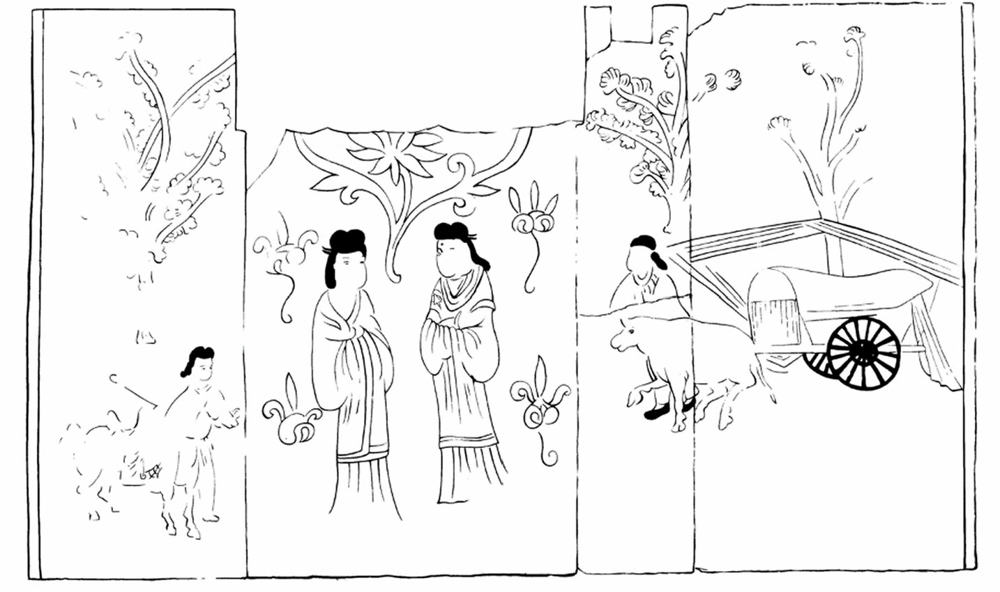

> 原档：B017
>
> 教师：倪润安

南北朝时期佛教繁荣发展

- 南方对佛教毕恭毕敬（梁武帝舍身入寺，或为了以佛的形象统治国家）
- 北方佛教（平城）在皇权干预下走完全不同的道路

《魏书·释老志》记载从汉代以来佛教传入过程

### 1.道武帝-明元帝-太武帝时期的平成墓葬与佛教文化

#### （1）前期北魏

- 前身代国，在长城地带发展壮大
- 前秦俘虏到南方，与慕容氏（后燕）有姻亲关系
- 从慕容氏了解中原文化，非常愿意吸收
  - 国名改“魏”
  - 叁合坡战，对当地后燕人“苟有微用，咸蒙叙用”

#### （2）道武帝、明元帝佛教政策

目的：战乱时聚拢百姓，令沙门辅导民俗

吸纳宗教社团，僧官制度，法果“拜天子如来”

#### （3）太武帝佛教政策

太武帝信寇谦之道教

灭北凉后凉州僧众涌入平城怕【南方僧众特点：习惯不敬皇帝。高僧玄高、太崇私结太子、大臣（拜师），威胁皇权，高僧被杀】

武帝灭佛，诏诛长安沙门（长安僧众有不守清规藏妇女、藏武器情况），焚毁佛像，而后灭佛拓展至全国范围

#### （4）平成墓葬与佛教因素

沙岭北魏壁画墓（太武帝晚期）

- 伏羲女娲：河西特征（汉代传入河西，但后来在中原消失，此时是由河西传入，视为河西特征）
- 摩尼宝珠，有仙道色彩（仙草）
- （漆棺边、壁画边花纹）桃形忍冬、**蓝红两色连续波状忍冬纹**（忍冬纹：“火”字形，地中海传入河西）
- （墓主人大氅（chǎng）边）**忍冬枝上长莲花**（中国化）

当时颜料，蓝红两色中蓝色到今天腐蚀更严重

大同智家堡棺板画墓

- 佛教人物（力士）

### 2.文成帝-献文帝-孝文帝早期

#### （1）文成帝

文成帝是佛教徒

- 恢复佛法：重新选高僧官道人统：师贤（深得法果，为文成帝造石像，把皇帝塑造成佛祖）
- 昙耀继承师贤：武州石窟（五窟，均为三侍佛），为太祖以下五帝铸释迦立像

皇权与佛教妥协互利。吃财政饭，形成“国家佛教”

#### （2）献文帝

献文帝积极崇佛：主动研习佛教义理

根据自己理解兴佛：永宁寺（佛权向皇权妥协，皇权也在追求皇权与佛权统一）

#### （3）孝文帝早期

- 在永宁寺设供设斋
- 在献文帝陵前造建明寺
- 为冯太后（方山永固陵）建思远寺、报德寺
- （佛教兴盛后，孝文帝中期停止了大规模经费开支）

#### （4）平成墓葬与佛教因素

- 壁画
  - 新出现棺环两侧的忍冬
- 葬具
  - 石椁
    - 壁画衰退，主要画在葬具上
    - 莲花、忍冬。新出现单枝独立忍冬草图案（大型）

邢合姜墓石椁：改世俗人物生活画为成组的佛像、怪兽、飞天

- 葬具
  - 木椁：石椁的低等级替代品
  - 棺床（田村北魏墓）
  - 陶器：平沿、盘口罐、瓶，石灯，漆器

### 3.孝文帝中晚期

1. 佛教制度，不再进行大规模开窑、修寺，转而推动高僧讲经说法、钻研义理
   - 僧制四十七条
2. 墓葬制度
   - 东晋灭亡后，刘宋放弃晋传统（发生于文成帝后期）
   - 北魏由继承十六国传统/汉传统（赵、秦、燕）转为继承西晋传统
     - 迁洛阳，改汉制
     - 薄葬文化：墓葬简化
     - 北魏编《晋书》称十六国为“载纪”，区分“本纪”

#### 平成墓葬与佛教因素

- 壁画
  - 正中出现空白，只画边框（即画立柱、斗拱等，表达建筑结构）
  - 甬道护法保留（镇墓）
- 葬具
  - 形制简化：不见椁，只见石棺床和砖棺床（有的配有围屏：司马金龙墓）
  - 棺床上仍有绘画，且不只有忍冬纹，穿插有人物、神兽（老师表示是因为政策缘故，原来应该画在壁画上的画都因为壁画不能再画，转而挤在葬具的忍冬纹之间）
  - 石雕杖座
- 陶器：稍有简化（花纹圈数）
- 其他遗物（怀仁丹阳王）

