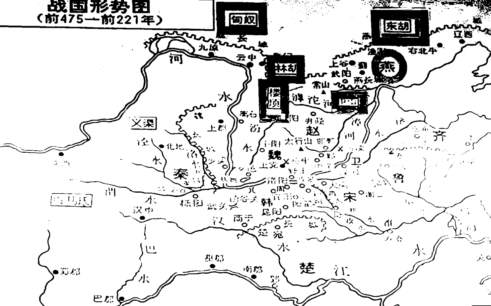
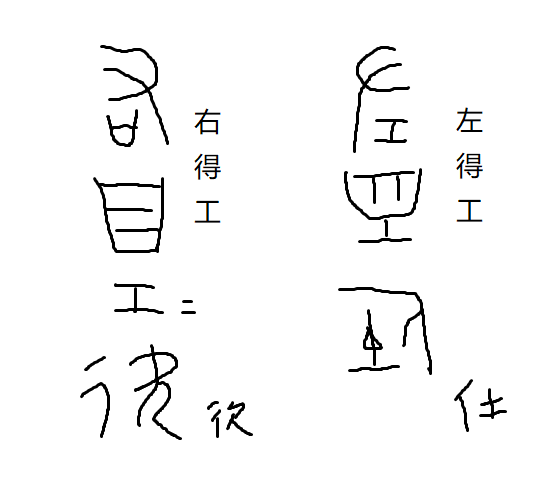
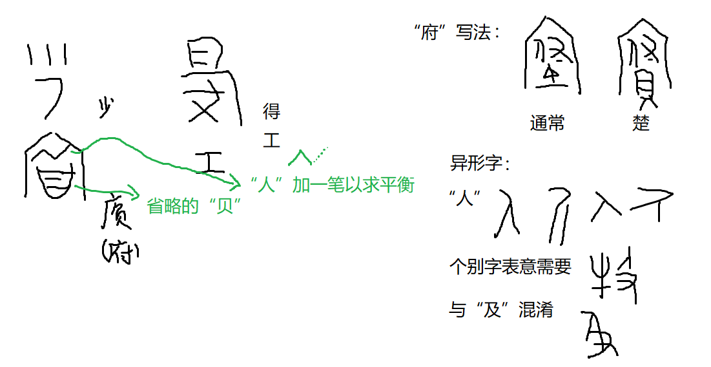

> 原档：A014
>
> 2006/4/7

赵国都邑：汾水上游（今太原）→邯郸

### 1.胡服骑射历史

#### （1）大趋势：西北胜东南，再被同化为“东南”。西周灭商、秦灭六国...

#### （2）赵族华夏化

- 赵来自夷狄。秦、赵共祖颛顼
- 造父事周穆王，赐赵城（造-赵通假。通假字分别用于人名地名的例子：周懿王改康为卫侯，殷后裔，殷-郼-衛）
- 非子为孝王养马，赐秦邑
- 造父后为叔带。叔带去周幽王入晋，赵衰（成子）辅佐晋文公，赵盾（宣子）弑晋灵公，赵武（文子）执政，赵鞅（简子）掌权，赵毋恤（襄子）灭伐（美人计）、三家灭智氏分晋

#### （3）胡化

- 赵烈侯，受封诸侯，改革
- 赵敬侯，迁邯郸
- 赵成侯
- 赵肃侯
- 赵武灵王 胡服骑射（从此以后才有题铭记载）

汉人所谓的“匈奴”在楚汉之际秦不修长城才进入中原，之前文献记载的“匈奴”是广义的“胡人”，除汉人（冠带战国七）以外的所有外国人。如胡服骑射灭林胡、楼烦，宣太后以身饲虎灭义渠

#### （4）战国形势

赵：**“四战之国”**：备燕、三胡、秦、韩之边

地理位置：三块地（汾水上游、邯郸、代）被太行山、中山国（联合齐）阻隔

#### （5）古肥义、楼缓等大臣谋，实行胡服骑射

- 胡服-等级制度的改革（服饰）：别上下、别内外
  - 北方民族的冠带、服饰
  - 便于骑马
- 骑射-军事制度的改革
  - 原：乘马丘牛（老爷兵，马为了驾车）
  - 增设骑兵、弓箭手，骑邑训练骑兵

增强了军事实力

### 2.鄂尔多斯式青铜器

#### （1）燕下都辛庄头M30：豕虎乞（以北京为中心的出土区，是赵孝成王19年燕赵易土所得的“武阳”）

北部被盗，南部塌陷，大部分文物保留

##### ①铭文

1. 制造。“得工”，宫廷工官。

   

2. 计重：斤、两、朱（铢），可精确到1/8铢（“八分铢一”）

3. 标题：“成入（纳）虎豕”“故寺（持）豕虎乞（龁 hé）

##### ②图案

对称构图（中原文化传统，商周常见）

- 方形器物轴对称
- 圆形器物旋转对称（C3）

熊食羊、虎豕咬斗

马、牛（被咬）

长方形牌饰中咬豕怪兽或抽象简化为角状符号

##### ③传世文献中的记载

鲜卑、胥纰、犀毗、私鈚（头）、黄金师比、郭落带

#### （2）西沟畔M2（以鄂尔多斯为中心）

鸟喙怪兽

器物多为镞（三角尖刀）

一熊二羊中羊抽象为卷云纹

- 大府：国家财政
- 少府：王的私家娱乐开支
- 中府（内府）：附属于少府，管公主皇后
- 小府：王国郡守的私家财产

#### （3）鄂尔多斯地区墓葬中人骨鉴定为中原人

#### （4）华夏服饰：命服

- 巿：围裙
- 黄：腰带，持衡

赤巿幽黄、载（淄）巿冋（檾，麻绳）黄