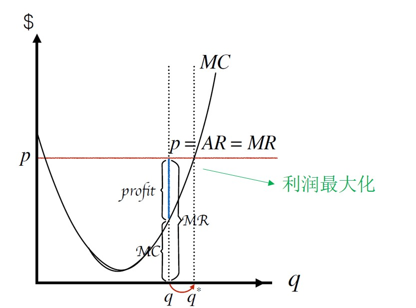
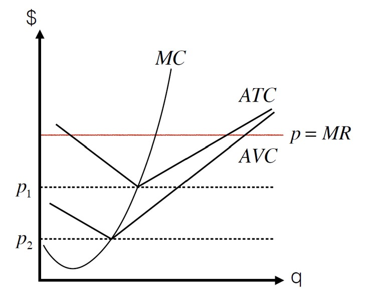
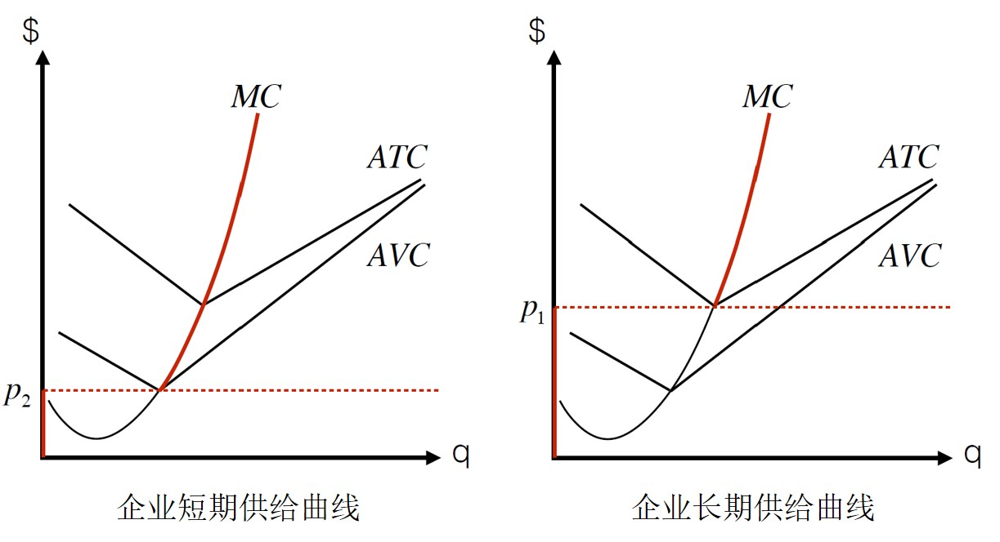
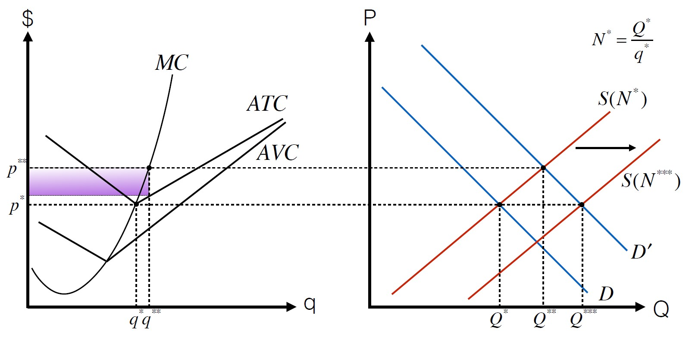
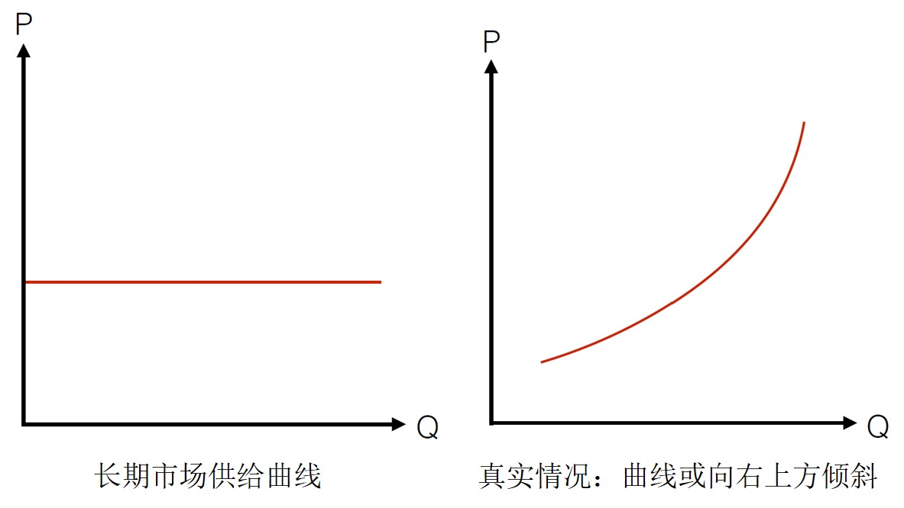

> 原档：B036
>
> 本讲原标题：Producer Theory: Perfect Competition

利润=收益-成本

上讲：成本曲线——无关市场、价格

本讲：**竞争企业的收益——有关市场、价格**

### 0.完全竞争

个体企业生产无法改变市场价格。价格是外生变量

企业是价格接受者

### 1.企业利润最大化

假定企业在市场上（短期不能退出市场），市场完全竞争下（即给定价格下）：

总收益曲线 TR=p*q

总利润 Π=TR(q)-TC(q)

- 情况1：亏固定成本（如租金），不经营为最优决策
- 情况2：始终亏损，但经营弥补固定成本
- 情况3

完全竞争下的企业：平均收益=边际收益=价格（不相等时企业调整产量）

### 2.企业的市场行为

#### 短期：固定成本为外生变量

**固定成本为外生变量**，是沉没成本，不考虑（即使亏也要少亏点，不影响决策方向）；考虑当下（理性人考虑边际）

*跑北马，跑到19公里，再跑就要死了。不跑（理性人）。都跑了那么多了，要跑完（非理性人）。*

- p2：停止生产价格（边际收益小于可变成本时停止生产，只亏固定成本）
- p1：收支平衡价格（经济利润为0）

#### 长期：固定成本内生化

企业长期可以选择退出市场，停止亏损

### 3.个体企业与市场供需（比较静态）

#### 假设所有企业完全同质，成本曲线相同

#### （1）短期：不允许自由进出市场（即第三讲的供需模型，比较静态）

需求增大，有利润时，Q↑=N*q↑。企业增产且赚取经济利润。

#### （2）长期：允许企业自由进出市场

**长期供需颠覆了第三讲的供需模型**

需求增大，有利润时，更多企业进入，到利润为0时均衡（q*在MC与AVC交点）

（简化模型：不涉及企业，仅从总产量考虑。——一种外生变量内生化）

*看着很热闹，但不挣钱*（经济零利润）

### 4.长期市场供给曲线

真实情况：资源有限；企业的异质性（全世界只有4个好矿，无限多烂矿。矿卖的特别好，会有烂矿进入，但成本提高）

更平缓，有弹性。

结果：

- 企业生产始终在ATC最低点
- **从社会生产角度：每个企业都在有效规模。完全竞争使产品的生产成本最小。**

*老师的质疑：“长期供给曲线”与供需模型中供给曲线原始定义（“给定其他条件不变”。其他条件包含企业数量）有冲突（应该没有“长期供给曲线”的概念）。*我认为从模型简化角度这种质疑没价值。