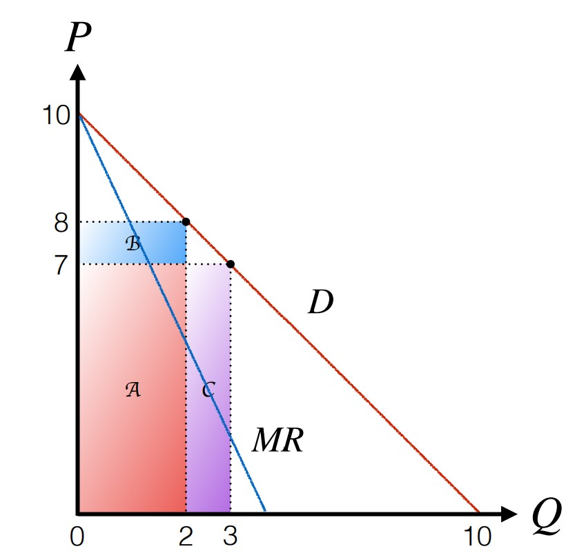
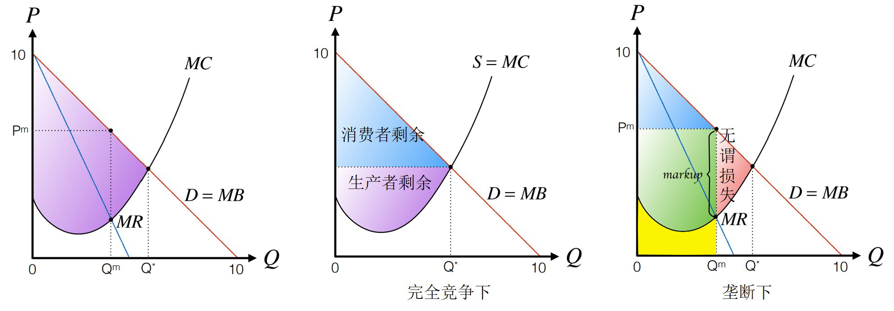

> 原档：D001

|          | 完全竞争 | 垄断（的）竞争 | 寡头（竞争垄断） | 垄断   |
| -------- | -------- | -------------- | ---------------- | ------ |
| 消费者   | 多       | 多             | 多               | 多     |
| 厂商     | 多       | 多             | 若干             | 一个   |
| 产品     | 同质     | 略微不同       | 同质             | 就一种 |
| 进入壁垒 | 无       | 无             | 有               | 有     |

### 1.垄断

一类产品唯一的卖家是垄断企业

没有相近替代品

### 2.市场势力

- 完全竞争下，市场是价格接受者；垄断下，市场是价格制定者
  - 不面临价格和数量的权衡取舍——想多卖一单位，只需生产无需降价
  - （市场需求曲线向右下方倾斜。）**完全竞争企业是众多卖家中的一个，面临水平需求曲线（市场需求曲线/∞）；垄断企业面临向右下方倾斜的需求曲线（市场需求曲线）**
    - 给定q，根据需求曲线有最优定价
    - 虽然p也能自己决定（对垄断企业是内生变量），但**“利润最大化⇒MC=MR”**（边际成本=边际收益）对任何市场结构适用
- 产生原因：进入壁垒
  - 天然资源
  - 政府管制
  - “自然垄断”：排他、非竞争，自发形成垄断（某企业能以低于大量生产者的成本生产）

### 3.利润最大化

从(2,8)到(3,7)。总收益：用B（价格效应带来亏损）换C（产量效应带来利润）
$$
P = b − k × Q\\\\
TR = P × Q = b × Q − k × Q^2\\\\
 MR =
\frac{dTR}{dQ}
= b − 2k × Q
$$
边际收益曲线与需求曲线截距相同，斜率为二倍关系

<u>**完全竞争时，斜率均为0（需求曲线——弹性为∞），D=MR，Q\*=Qm。垄断下，D≠MR，Q\*≠Qm，偏离社会最优产量。**</u>

#### 利润最大化

### 4.垄断下的福利分析

价格（“边际收益MB”）=边际成本（边际成本MC）：社会最优

#### 社会总剩余

- 完全竞争下社会总剩余最大
  - 每一最后单位生产成本等于消费者支付意愿
- 垄断下社会总剩余并非最大，有无谓损失
  - 最后一单位消费者支付意愿与生产成本差“加成（markup）”

#### 题外话

1. MR vs. MB
   - MR是企业角度的边际收益（Marginal Revenue）
   - MB是社会计划者角度的“边际收益”（Marginal Benefit），与市场结构无关，刻画消费者支付意愿（其实就是需求曲线）
2. 生产者剩余 vs. 利润（继续观察垄断的福利分析）
   - 绿色面积：生产者剩余
   - 黄色面积（边际成本曲线以下的面积）：**总可变成本TVC**
   - 绿色+黄色面积：**总收益TR=Pm*Qm**
   - ⇒总利润=生产者剩余-总固定成本
   - ⇒固定成本沉没。垄断最大化了总利润，也**最大化了生产者剩余**。

### 5.政府政策

- 阻止合并、分拆公司、禁止企业削弱竞争（如捆绑销售——上游向下游拓展垄断）
- 国有企业：目标不再是利润最大化（改变目标函数），产生额外社会成本，需要制度设计（短期可行，长期存疑）
  - 本质上都是使企业重回价格接受者
  - 价格管制：边际成本定价、平均成本定价

### 6.自然垄断

边际成本恒定，平均总成本递减

### 7.价格歧视

电影学生票、折扣券、大学奖学金、数量折扣、打印机的种类、饿了么红包

- 一级价格歧视（完全价格歧视）：厂商根据消费者支付意愿制定价格
  - 全部剩余为生产者剩余。社会总剩余（可以）最大（有效率）
  - 不用面临价格与数量的权衡取舍
- 三级价格剩余：根据消费者群体（分两个以上市场）
  - 可以获得不少于单一价格垄断下的利润
- 二级价格剩余（非线性定价）：根据购买量
  - *信息甄别模型（screening model）