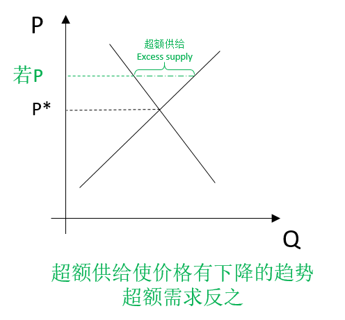

> 原档：C017

### 1.市场（Market）

买方/消费者（的偏好）决定需求

卖方/厂商（的利润最大化）决定供给

### 2.其他条件不变时，对价格p、数量q的研究

#### 2.1.Q和D(Q)/S(Q)

- 需求量Q（Quantity Demanded）：消费者看到价格后**愿意且能够**购买的数量

- 需求D(Q)（Demand）：需求量与价格的关系（刻画买方偏好）

- 供给量Q（Quantity Supplied）

- 供给S(Q)（Supply）

Q表示整个市场的需求量/供给量，q表示一人的。研究：所有人看到一样的价格

需求定律：其他条件不变，价格上升，需求量会上升

$$
P=D(Q),\frac{\partial P}{\partial Q}<0
$$

供给定律：其他条件不变，价格上升，供给量上升

$$
P=S(Q),\frac{\partial S}{\partial Q}>0
$$

#### 2.2.所有人看到一样的价格时，D是d在每一价格上的水平加总（horizontal summarization)

### 3.其他条件对需求D(Q)、供给S(Q)的影响

#### 3.1.需求D(Q)的变化由除价格外其他因素（X）引起

- 收入
- 相关产品价格
- 预期（Expectation）
- 买者数量
- ...

需求的变化情况可刻画**产品类型**

##### ①X为收入时

若“需求”（此指任意价格上的需求量）随收入↑而↑，称为正常品

随收入↑而↓，称为低档品

下面情况同样允许

##### ②X为其他产品价格P̃时

“需求”随P̃↑而↑，称它们为替代品（Substitues）

随P̃↑而↓，称它们为互补品（Complements）

#### 3.2.供给S(Q)的变化由除价格外其他因素（X）引起

- 要素价格（Input prices），与另一个市场相联系
- 技术
- 预期
- 卖者数量
- ...

##### ①技术进步会导致“供给”↑

#### 3.3.与需求、供给定律结合分析

住房价格升高导致购买量也升高——不符合需求定律，应为需求曲线的移动（是对未来房价上涨的预期导致的）

提防伪分析，P随Q变化是在需求/供给曲线上移动，D(Q)/S(Q)的变化是曲线的移动。混淆：支农政策导致增产，增产导致降价，降价导致减产。（脱离消费者谈厂商的情况）

### 4.均衡分析（Equilibrium）

供给量与需求量平衡于平衡价格P*（市场出清价格，每个人都得到满足）

使供需（量）平衡的数量为平衡数量Q*

——根据供给定律、需求定律，如果出现交点，则唯一

#### 4.1.偏离均衡

#### 4.2.模型假设

- 有充分竞争（且无摩擦）
- 市场中无人拥有市场势力（market power）：定价权。所有人都是价格接受者

因此有拓展空间

- 有许多消费者时？
- 有许多生产者时？
- 产品不完全同质时？

### 5.比较静态：价格不断波动，用模型的两个静态差异理解动态变化

研究价格变动的工具

外生变量（自变量），内生变量（因变量）

所谓的“分析”就是外生变量的内生化

#### 5.1.价格、数量变化的原因研究

导致价格、数量变化的两个方式

- 需求变化：沿供给曲线，价格和数量相同变化
- 供给变化：沿需求曲线，价格和数量相反变化

可据此研究**价格、数量变动时 供给、需求的变动哪个是主要原因**

#### 5.2.价格有黏性，冲击后会先偏离均衡

#### 5.3.**“一般均衡分析”**：市场产品间替代、互补关系普遍存在

### 6.边际的力量：重温供需

需求曲线≈边际收益曲线（人数越多，边际收益曲线越趋近于连续）

边际卖家支付意愿即价格