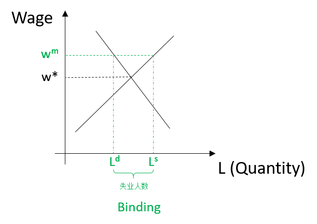
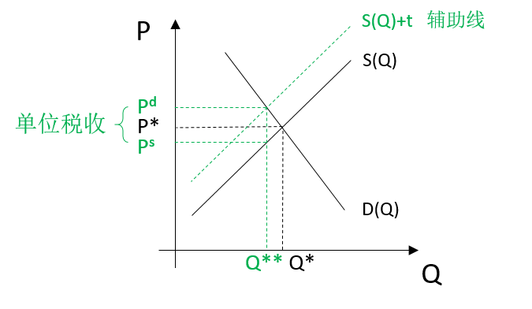

> 原档：C027

政策对市场的作用

- 利用供需模型分析对市场的影响
- 评价市场的标准：效率和公平
- 不同政策比较

政府政策包括

直接控制：价格控制（price control）、数量控制（quantity control）

间接控制：税收及补贴（taxes&subsidies）

## §1.政策下的市场结果（供需模型均衡分析——核心为充分竞争）

### 1.价格控制

价格上限（ceiling）

价格下限（floor）：助农...

#### 1.1.价格上限

黄牛的产生一定程度**<u>恢复价格机制</u>**，但较复杂（依赖市场势力、议价能力，价格不同）

产生配给（rationing）制度。配给制度原则多样：

- 市场被动产生：排队、走后门、卖者对买者的歧视（房子租给做饭油烟小的客人，租给没小孩的客人）...
- 官方主动：抽签、票证...

##### 国内票证制度

1. 1953，“一五”计划，短缺经济
2. 政府主导配给原则，统购统销+票证
3. 1955《市镇粮食定量供应票证印制暂行办法》
4. 1961，票证类型达到156种
5. 其中存在相互交换、贿赂等行为：**恢复价格机制**（用物品代替货币）

##### 美国受到OPEC原油禁运影响

1. 1974，OPEC对美国原油禁运
2. 美国原油供给减少：支付意愿小的消费者挤出市场（价格机制）
3. 政府认为不公平，设置价格上限，导致加油站前长队
4. 1974-1979，实行汽油配给券制度

排队是市场被动配给制度，短期内存在（由于价格的黏性），长期会导致选择替代物

##### 租房控制

纽约、华盛顿仍保持租房控制。

- 短期内：供给、需求（-价格）都缺乏弹性，比较陡峭
- 长期导致无效率（租房控制是“除了炸弹外毁掉一个城市最好的办法”）
  - 非价格配给：排队、歧视
  - 浪费住户时间
  - **房东无心维护（需求过量导致质量下降）**

#### 1.2.价格下限

##### 劳动力市场的价格下限——最低工资

- 硬性：最低工资法律
- 软性：欧盟当价格低于干预价格时，亲自购买堆积在仓库（需求曲线右移），价格上升

##### 蓝领市场价格下限与David Card

可执行地提高wage

- Ld下降（需求）：Ls-Ld为失业人数，上升。
- Ls上升（供给）：促进就业

现实中，当没有充分竞争，当厂商有市场势力时（“一个深圳只有一个富士康”）最终结果是促进就业。（David Card）

### 2.数量管制

规定（Binding的）最高数量

eg.进口配额（quotas）、汽车牌照（拍卖/摇号）

- 拍卖：支付意愿（不公平）
- 摇号：公平

### 3.单位税/单位补贴

分为对厂商、对消费者

#### 3.1.均衡分析

$$
\begin{cases}P^d=D(Q) & ① \\\\
P^s=S(Q) & ② \\\\
P^d=P^s=P^* & ③
\end{cases}
$$

对厂商征税时③变为 Pd=Ps+t，对消费者征税时变为Ps=Pd+t

税收/补贴不改变意愿(D、S函数不变)

- 交易量下降
- 消费者支付价格上升
- 厂商实收价格下降（美国价签标价与付款价格不同，“不含税价格”）

#### 3.2.税收/补贴本质：**创造价差**

#### 3.3.对厂商征税和对消费者征税完全等价

#### 3.4.比例税/比例补贴改变斜率，分析方法一样

#### 3.5.税收的划分——税收负担

t消=(Pd-P*) *Q

t厂=(P*-Ps) *Q**

比较静态：缺乏弹性的需求。

弹性是局部概念，过一点（交点）的斜率。

**弹性较小的一方不轻易离开市场，承担更多税收。**

税收最终归属取决于弹性而非政府。