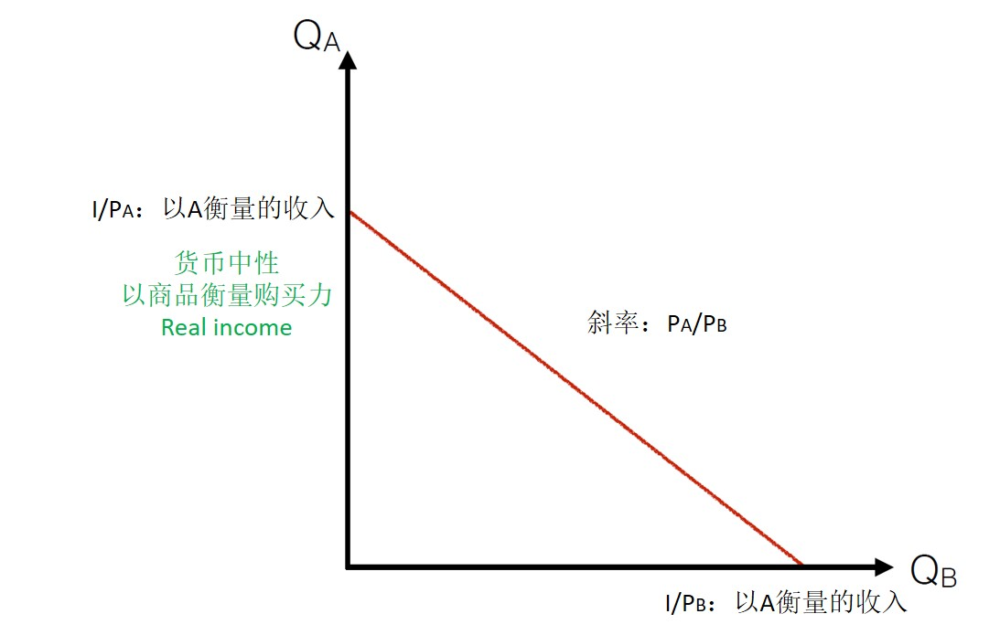
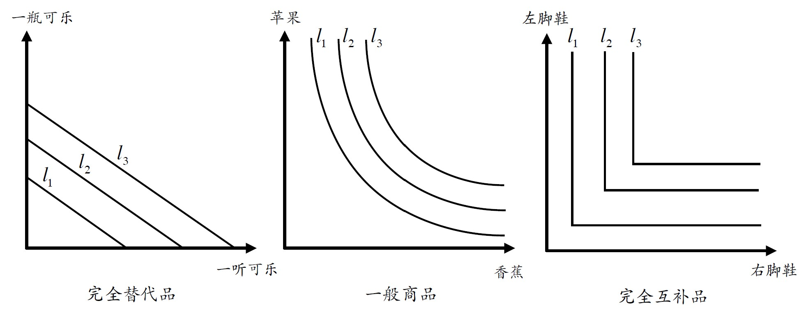
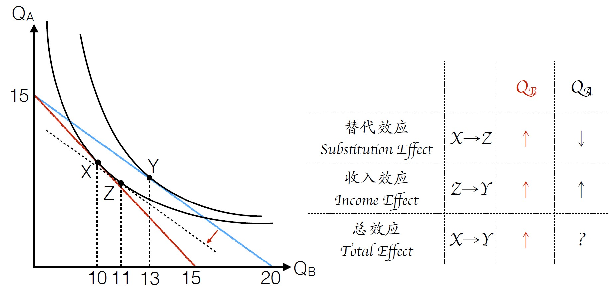
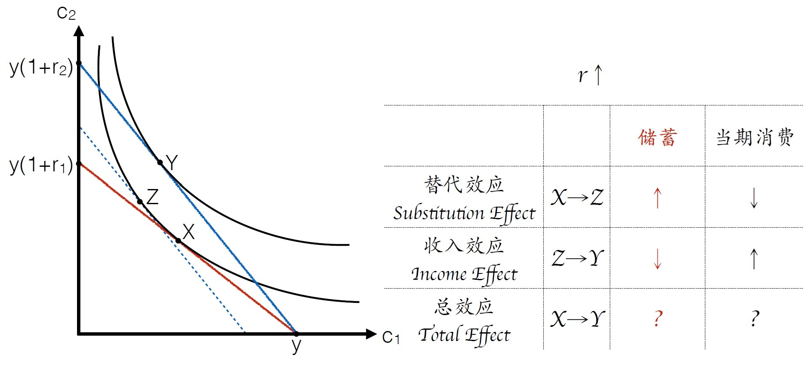

> 原档：B022

课程框架

1. 价格理论（完全竞争的市场）
2. 外部性可能导致市场无效（增加的一点说明）
3. 放宽完全竞争假设（拓展价格理论）
   - 需求曲线的微观（消费者的最优决策）
   - 供给曲线的微观（厂商）
4. 不完全竞争：垄断

------

### 1.本讲问题：为什么需求曲线——预测消费者行为

需知信息：

- 可供选择的产品组合（bundle） 收入与价格——预算约束线（线性定价时，预算约束线为直线） 
- 偏好
  - ~~如A必须搭配B，购买等量两种物品→消费比在QA=QB线上？但没有刻画线外组合的取舍（这样对偏好的刻画是必要不充分的）~~
  - 无差异线（类似等高线）
    - 理性的条件：偏好是完备的（任何两种组合都可以比较）
    - 满足度成为效用（utility）

### 2.无差异线的基本性质

1. 一般向右下方倾斜（A、B都是越多越好；相同效用水平，面临A和B的权衡取舍）**一阶导数**
   - 切线斜率：此处的边际替代率（MRS）（用A换B）
2. 满足1.以后：较高曲线较高效用
   - 大小比较可传递
3. 曲线不相交
4. 一般凸向原点（均衡为好，A多B少时边际替代率高）**二阶导数**

#### 无差异曲线分类

1. 完全替代品：边际替代率恒定（直线）——基本性质4.的极端
2. 完全互补品：无差异线为与QA轴、QB轴平行的两部分构成的直角——基本性质1.的极端
3. 一般商品（不完全替代→人们喜欢多样性）

*经济学研究上，先用完全替代品、完全互补品考虑，如果结论一致，可能此研究不依赖于偏好*

### 3.最优的消费组合

在预算约束线上

在可达到的最高效用无差异曲线上

——切点

**预算约束线斜率为PA/PB（关于商品），最优组合时与无差异曲线相切，因此边际替代率（关于消费者）也是PA/PB**

**消费者对两物的评价与市场对两物的评价（相对价格）相同时，为最优消费组合**（条件：线性定价）

——以市场为指挥棒行为

### 4.对价格的比较静态

经济学直觉（一般品）

- 香蕉降价，以香蕉衡量的收入（I/PA）更富有：收入效应
- 香蕉对于苹果更便宜（PA/PB）：替代效应
- 共同导致需求定律

对于劣等品（收入效应反向），一部分也满足需求定律；当收入效应反向超过替代效应时，违反需求定律（吉芬物品）——*稍微有一点钱就特别厌恶（很强收入效应的劣等品）*

### 5.应用1：劳动供给（Labor-leisure Choice Model）

时间即模型中的价格

- 闲暇更贵（预算约束线斜率，同样品质的闲暇与收入比较更占时间）：替代效应
- 更富有（少花一些时间可以获得同样品质的收入）：“收入”效应

**直觉（收入越多越投入时间）往往来源于替代效应，但忽略了收入效应**

### 6.应用2：利率与储蓄（未来消费）（Interest Rate and Savings）

|      | 收入（y） | 消费（c）             |
| ---- | --------- | --------------------- |
| 一期 | y         | c1=y-s     |
| 二期 | 0         | c2=s×(1+r) |

预算约束线有公式
$$
c_1+\frac{c_2}{1+r}=y_1+\frac{y_2}{1+r}\\\\（终身消费=终身财富）
$$

r（利率）增加：

- 替代效应：今天消费更贵，明天花
- 收入效应：整体更有钱，今天也要多花