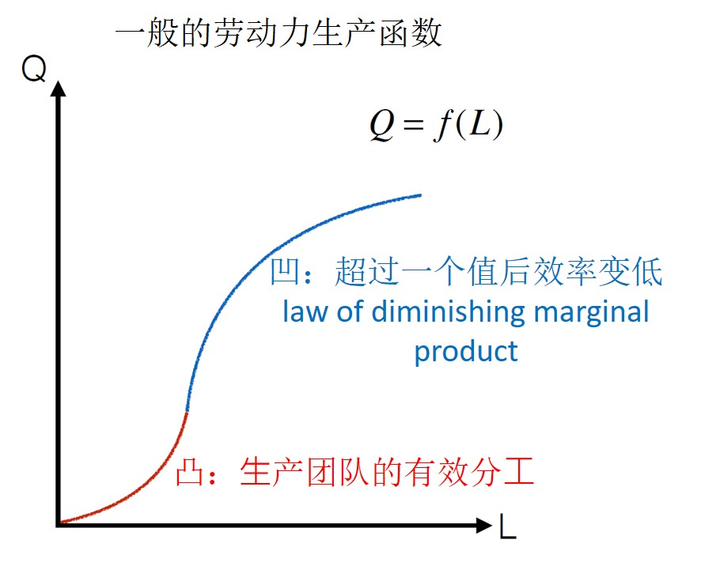
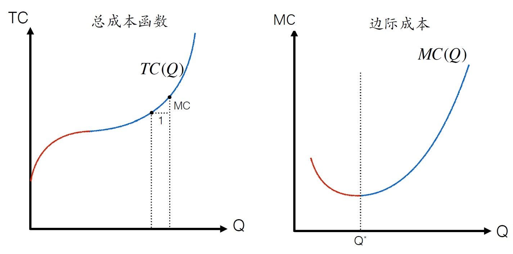
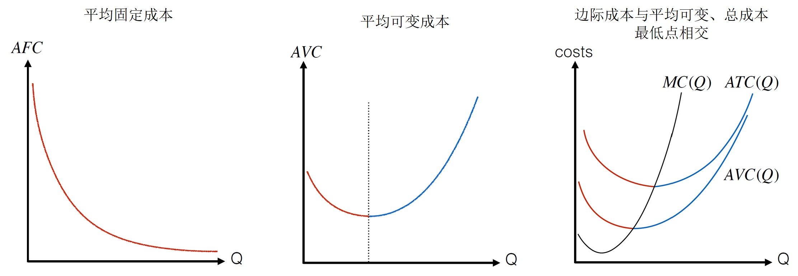
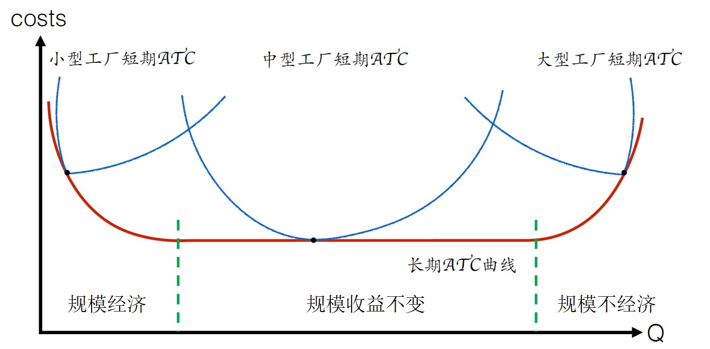

> 原档：B026

企业目标：利润最大化（经营效率）

### 1.经济利润

- （经济）利润=总收益-总成本
  - 总收益=价格×数量（假设只卖一种产品&线性定价）
  - 总成本（机会成本）=总显性成本+总隐性成本
- 会计利润=总收益-总显性成本

- 会计利润为正不一定经济利润为正
   - 航空公司对机场服务的租赁
   - 员工工资只是显性成本
     - 企业主将自有资金投资于企业
     - 创业初期核心成员无偿为企业工作
- “零利润”：零会计利润
- 零经济利润：会计利润为正
- “超额利润”（EVA）：世界只有1/3的上市公司EVA为正

### 2.成本曲线

#### （1）生产成本

考虑煎饼摊

1. 生产投入要素：店铺租金，工资，鸡蛋、葱花、辣子、薄脆、
2. 生产所需的技术（生产函数：成本量到生产量的映射）
   - 生产函数 Q=f(K资本,L人工)
     - 简单化→ 仅考虑人工

#### （2）生产函数的基本性质

- 向右上：f'>0
- 过原点：f(0)=0

边际产量：增加一单位劳动力（dL，或其他要素）带来产量的增加dQ

- <u>gain of specification</u>
- <u>law of diminishingmarginal product</u>

#### （3）总成本函数

总成本=固定成本（要素价格、租金等）+可变成本（人工）

只是将可变成本生产函数向上平移（固定成本）得到

先凹后凸同样由于 **law of diminishingmarginal product**

#### （4）最优决策：平均成本曲线

相交：当MC<ATC时，新增产量拉低成本；当MC>ATC时，新增产量抬高成本（两侧两个曲线方向都相反，中间相交）——是趋势问题，所以也过AVC最低点

### 2.长期成本与短期成本

短期内固定成本在长期会变为可变成本（企业可以改变现状）

——外生变量内生化

#### 建设大型工厂

多雇人可以不选择没效率的方式，而是复刻同样厂房，这样ATC曲线不上升而是在最低点形成平台

但最终仍会上升，是大型组织的协调问题（组织经济学）

