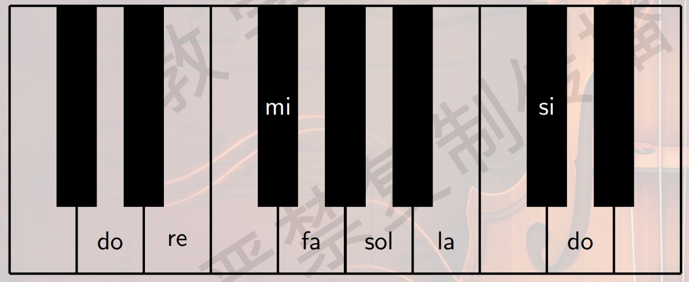
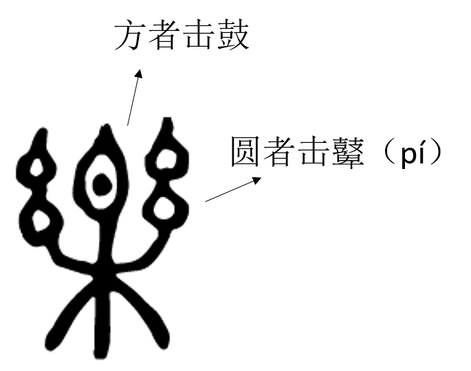

> 原档：C016

### 1.声音的物理属性

声波是纵波

频率与振幅：对于频率的感知是非线性的。

实际声压/力度（实际Pa）$\stackrel{取log}{\rightarrow}$声压水平/感知（Db），P₀=20μPa（蚊子离3米远）

音色（timbre）：波形

#### 音色：

##### 1.波形有包络（envelop）

- Attack：起音
- Decay：衰减
- Sustain：持续
- Release：释放

##### 2.频率成分

频谱（spectrogram）：各频率波形随时间变化。一个频率的声音其实又不同频率的波组成（复合波）

傅里叶分析：满足一定条件的周期函数f(x)可表示为sin、cos的无穷级数（分解为简单波）

$$
f(x)={\frac{1}{2}}-\sum^{\infty}_{n=1}{\frac{1}{n \pi}sin(nx)}
$$
无穷时才连续

### 2.乐音体系

乐音、噪音的区分：是否连续有规律。

用于音乐中的噪音：打击乐。包括有固定音高、无固定音高【小军鼓、镲、大炮（俄罗斯《1812序曲》，《地图 第三乐章 打溜子》）】

#### 2.1.乐音体系是音级的集合

#### 2.2.音名 CDEFGAB（按白键标号）

88键标准钢琴：A₀-C₈（0开始），97键钢琴：八个八度+C₈

网图：

♯-升号，♭-降号：差一个半音

×-生一个全音（♭♭-降一个全音）

异名同音：×D=E，♯E=F

#### 2.3.唱名

固定唱名法：与CDEFGAB一一对应

（更好的）首调唱名法：do可对应任何一个音节，但要注意全、半音问题

### 3.音乐的坐标系——五线谱

上尺谱

#### 3.1.节拍和节奏是第一要素

- 节拍：强弱组合
- 节奏：不同时值音符组合

拍号

*《碟中谍》主题曲*

全休止符：贴4线下缘；二分休止符：贴3线上缘

#### 3.2.速度（tempo）

♩=60（每分钟60个四分音符）

#### 3.3.谱号

𝄞（G）若第一笔开始于二线，则表明二线为G₄

𝄢（F）若第一笔开始于四线，则表明四线为F₃

𝄡（C）若中心处于三线，则表明三线为C₄

五线谱不是线性坐标系，是按基本音级的

变音记号：记号后小节内（以及用连音号连起来的其他小节）同高音符都变音

### 4.音程（interval）

旋律音程、和声音程

#### 名称

度数（五线谱上线+间数）+半音数可确定音程

自然音程：可仅用白键完成

减、小、纯、大、增

大三C-E(4)，增三C-♯E(5)（仍为三度，虽然♯E≈F，但C-F(5)为纯四）

#### 协和

$$
\begin{cases}协和音程\begin{cases}完全协和：纯四、五、八 \\\\
不完全协和：大小三、六
\end{cases} \\\\
不协和音程：二度、七度、增减音程
\end{cases}
$$

- 毕达哥拉斯学派：频率简单整数比的音程协和
- 赫尔姆霍兹“泛音列重合理论”：频谱上重合。八度音程与泛音列都重合.f 2f 3f 4f, 2f 4f 6f 8f
- 斯图姆夫（Stumpf）：被试者更难区分和谐音程
- 是否有主观（文化）因素？

### 作业

反复聆听 Mozart: Zwölf Variationen in C über das französische Lied “*Ah, vous dirai-je Maman*” (K. 265)《十三变奏曲》。分析感受“重复”、“变化”和“发展”。

<video controls="" autoplay="" name="media"><source src="http://notes.lawaxi.net/files/%E9%9F%B3%E4%B9%90%E4%B8%8E%E6%95%B0%E5%AD%A6/Mozart12VariationsK265.mp4" type="video/mp4"></video>